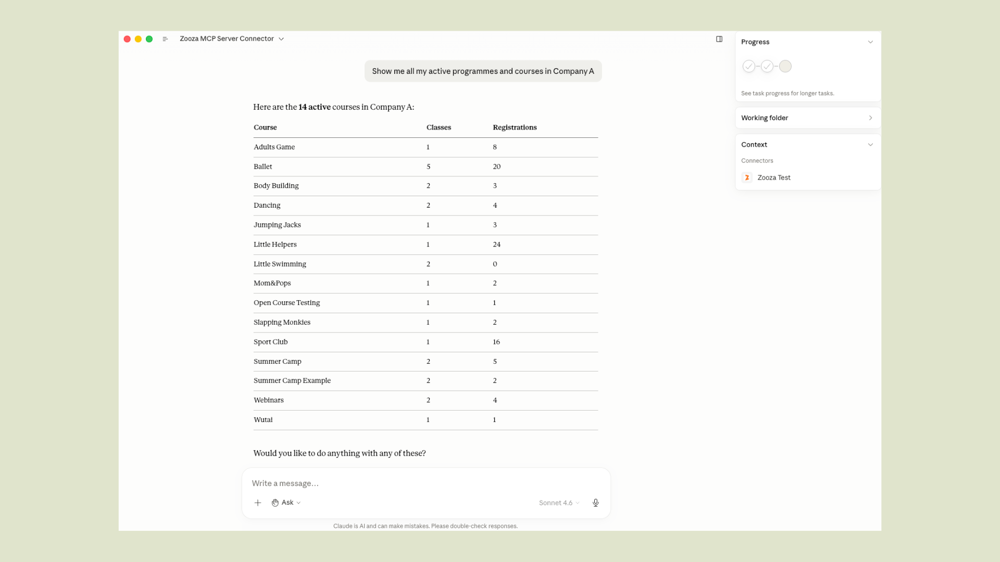
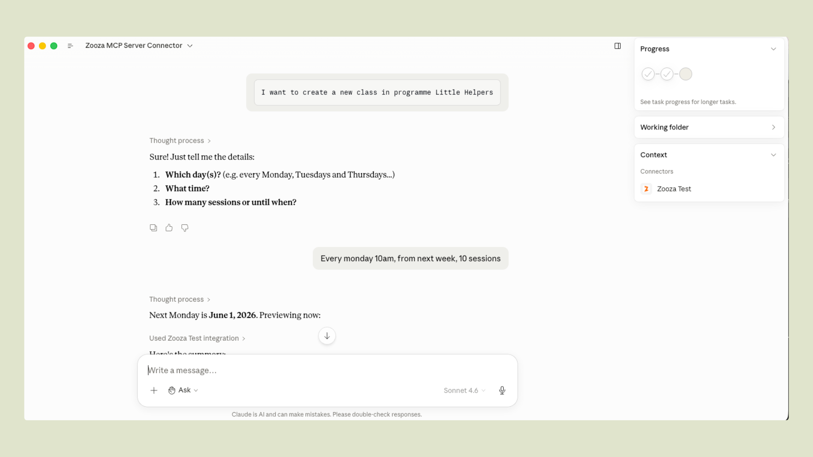
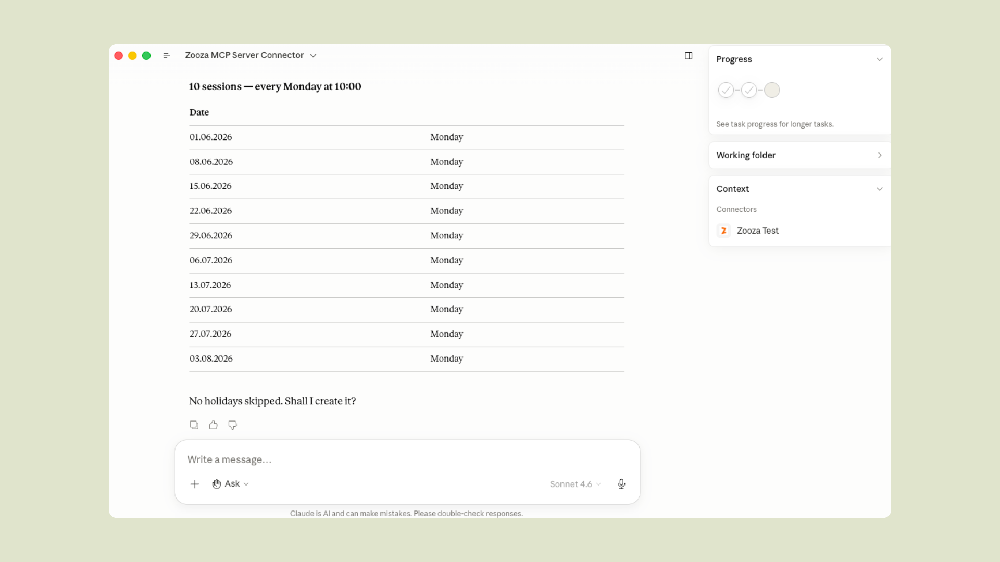

<p align="center">
  
</p>

<h1 align="center">Zooza MCP Server — AI-Powered Class Management for Activity Businesses</h1>

<p align="center">
  An open-source <a href="https://modelcontextprotocol.io">Model Context Protocol (MCP)</a> server that connects Claude, ChatGPT, and other AI assistants directly to your Zooza account.<br/>
  Natural language scheduling, attendance tracking, and class management — no dashboard required.
</p>

<p align="center">
  <a href="https://modelcontextprotocol.io"></a>
  <a href="LICENSE"></a>
  <a href="https://zooza.online"></a>
  <a href="https://mcp.zooza.app/mcp"></a>
</p>

<p align="center">
  <a href="https://zooza.online">Website</a> ·
  <a href="https://help.zooza.online">Documentation</a> ·
  <a href="#connect-in-2-minutes">Quickstart</a> ·
  <a href="#available-tools">Tools</a> ·
  <a href="https://signup.zooza.online">Get a Zooza account</a>
</p>

---

## See it in action

[](https://youtu.be/XPtMB_Id-Fo)

---

## What this is

**Zooza MCP Server** is a free, open-source Model Context Protocol (MCP) integration for [Zooza](https://zooza.online) — the class management and scheduling software for dance schools, language academies, swim schools, music schools, STEAM programmes, sports clubs, and other activity businesses.

It lets studio managers, school administrators, and franchise operators manage schedules, track attendance, create classes, handle bookings, and query their data through natural language conversation — using Claude, ChatGPT, or any MCP-compatible AI client — without opening the Zooza dashboard.

> **Zooza powers 500,000+ learners across Slovakia, the Czech Republic, Germany, the UK, and beyond** — from single-location dance schools to international franchise networks. This MCP server brings the same platform to any AI client that speaks the [Model Context Protocol](https://modelcontextprotocol.io).

**New to Zooza?** [Create a free account at signup.zooza.online](https://signup.zooza.online) — it takes under 2 minutes.

---

## What you can do

### Take attendance



```
"Open the register for tonight's adult ballet class."
"Who was absent from Saturday's Spanish beginners session?"
"Mark everyone present in today's robotics group."
"Add a note to this week's yoga class — we covered breathing techniques."
```

### Build a term from scratch



```
"Create a new Spanish for beginners course for Spring 2026 at the city centre location.
 Classes every Tuesday 16:00–17:00 for 12 weeks, starting 3 March.
 Assign trainer Tomáš Novák and preview the full schedule before I confirm."
```



```
"Set up our summer robotics camp — Monday to Friday, 9:00–13:00, for 4 weeks in July.
 Split into two age groups: 6–9 and 10–14. Preview both before I confirm."
```

### Get instant answers

```
"Which programmes are running this billing period?"
"Who's teaching dance on Monday evenings?"
"Which STEAM courses still have free capacity this term?"
"What sessions are scheduled for tomorrow?"
```

### Manage bookings

```
"Show unpaid registrations from this season."
"Which clients are on the waiting list for Saturday gymnastics?"
"How many spots are left in the beginner English course?"
```

No clicking through menus. No switching tabs. No automation scripts. Just ask — Claude handles the lookups, rosters, previews, and confirmations.

---

## Supported clients

| Client | How to connect |
|---|---|
| [Claude Desktop](https://claude.ai/download) | Native MCP over HTTPS |
| [Claude Code](https://claude.ai/code) | Plugin zip or manual `.mcp.json` |
| [ChatGPT](https://chatgpt.com) | OpenAI Actions — domain verified at `mcp.zooza.app` |
| Any MCP-compatible client | Streamable HTTP — `https://mcp.zooza.app/mcp` |

---

## Connect in 2 minutes

**Don't have a Zooza account yet?** [Sign up free at signup.zooza.online](https://signup.zooza.online)

### Claude Desktop

Add this to your `claude_desktop_config.json`:

```json
{
  "mcpServers": {
    "zooza": {
      "type": "http",
      "url": "https://mcp.zooza.app/mcp"
    }
  }
}
```

File location:
- **macOS:** `~/Library/Application Support/Claude/claude_desktop_config.json`
- **Windows:** `%APPDATA%\Claude\claude_desktop_config.json`

Restart Claude Desktop. On first use, you'll be prompted to sign in to your Zooza account — no API keys, no extra setup, just your existing login.

### Claude Code

Download the latest plugin from [Releases](../../releases) (file named `zooza-plugin-v*.zip`) and run:

```
/install-plugin zooza-plugin-v*.zip
```

The plugin includes the MCP connection config, guided workflow skills, and automatic session context.

> **Note:** Five of the 19 tools (`get_terminology`, `explain_data_model`, `comms_list_merge_vars`, `classes_list_schedule_patterns`, `negotiate_terminology`) work without any Zooza account — useful for exploring how the data model works before connecting live data.

---

## How it works

```
You → Claude / ChatGPT → Zooza MCP Server → Zooza API → Your data
```

The MCP server is **stateless and hosted by Zooza** at `mcp.zooza.app`. You don't run anything locally. Every request is authenticated against your Zooza account — Claude can only see and change what you're already allowed to access in the dashboard.

**Every write operation requires explicit confirmation** before anything is committed — Claude shows you what it's about to create or change, and only proceeds when you confirm.

**Regions:** EU (SK/CZ/DE/RO/HU/IT/PL), UK, US, and Asia regions are all supported. Your account is automatically routed to the correct regional infrastructure.

**Multi-location and franchise accounts:** Claude will ask which location to operate on at the start of each session. You can switch mid-conversation — useful for comparing across sites or managing a network.

---

## Languages & regions

Zooza MCP is designed for multilingual, multi-market operation. It understands regional terminology differences out of the box:

| Market | Language | How Zooza users say it |
|---|---|---|
| Slovakia | Slovak | kurzy (programmes), hodiny (sessions), dochádzka (attendance) |
| Czech Republic | Czech | kurzy / lekce (sessions), evidence docházky (attendance) |
| Germany / Austria | German | Kurse (courses), Stunden (sessions), Stundenplan (schedule) |
| UK | English | terms, registers, classes |
| Romania, Hungary, Italy, Poland | Local + English | supported |

The `negotiate_terminology` tool lets Claude learn your studio's specific vocabulary once and use it in every future conversation — so if you call programmes "kurzy" and sessions "hodiny," Claude will always respond in your terms.

---

## Available tools

19 tools covering scheduling, attendance tracking, class management, and Zooza domain knowledge.

### Scheduling & class management

| Tool | What it does |
|---|---|
| `classes_preview_schedule` | Preview a recurring class schedule before committing |
| `classes_preview_events` | Preview individual sessions across a date range |
| `classes_commit_class` | Create a class with a full recurring session schedule |

### Attendance

| Tool | What it does |
|---|---|
| `sessions_find_events` | Find scheduled sessions by date, trainer, or programme |
| `get_attendance_roster` | Get the full register for one session — who is enrolled and their current status |
| `sessions_mark_attendance` | Record attendance for each participant (attended / absent / late-cancel) |
| `sessions_add_summary` | Add a coach note or session summary to a completed event |

### Lookups

| Tool | What it does |
|---|---|
| `whoami` | Identify the connected user and list accessible companies/locations |
| `classes_find_courses` | Search programmes by billing period, name, or status |
| `classes_find_billing_periods` | List billing periods (seasons/terms) for a company |
| `trainers_find` | List trainers available at a location |
| `classes_find_places` | List rooms and locations for a company |

### Free tools — Zooza domain knowledge (no API calls, no account needed)

These five tools carry Zooza-specific knowledge and work without credentials — no Zooza account required. Useful for exploring the data model, preparing messages, and setting up vocabulary before connecting live data.

| Tool | What it does |
|---|---|
| `get_terminology` | Translate Zooza terms by region — e.g. "Programme" vs "Course" vs "Kurz" |
| `explain_data_model` | Explain how Zooza entities relate (Programme → Class → Session → Registration) |
| `comms_list_merge_vars` | Full catalogue of merge variables for Zooza message templates |
| `classes_list_schedule_patterns` | Reference for recurrence patterns (weekly, bi-weekly, block, camp) |
| `negotiate_terminology` | Save your studio's vocabulary to Claude memory for future sessions |

### Utilities

| Tool | What it does |
|---|---|
| `get_skill` | Load a guided playbook for multi-step workflows |
| `submit_feedback` | Submit a feature request or bug report to the Zooza engineering team |

---

## Skills — guided activity workflows

Skills are playbooks that teach Claude how to combine tools correctly for real operational scenarios. Claude loads the right skill automatically when it detects a matching request.

| Skill | What it handles |
|---|---|
| `class-management` | Full guided flow: interview → schedule preview → confirmation. Use when creating any class with recurring sessions. |
| `business-model-validator` | Validate a proposed programme structure against Zooza's pricing and billing model before building it. |
| `negotiate-terminology` | Interview the operator about their vocabulary and save the profile to Claude memory. |

**Coming next:** `cancel_day` · `transfer_booking` · `initiate_refund`

---

## Security & compliance

- **TLS** on all traffic between your AI client and `mcp.zooza.app`
- **OAuth 2.0** — Claude receives a scoped token tied to your Zooza identity, not your password
- **Permission inheritance** — Claude can only do what your Zooza account allows
- **Confirmation before write** — all operations that create or change records require explicit confirmation
- **No conversation storage** — the MCP server is stateless; your prompts are not logged by the MCP layer
- **GDPR-ready** — Zooza processes data in accordance with GDPR. See the [Privacy Policy](https://www.zooza.online/privacy-policy/) and [Terms of Personal Data Processing](https://www.zooza.online/terms-of-personal-data-processing/). EU accounts are routed to EU-region infrastructure.
- **Regional data routing** — EU, UK, US, and Asia regions each route to their own infrastructure; your JWT determines the region automatically

> Queries to Zooza MCP may be processed by your chosen AI provider (Anthropic, OpenAI, etc.). Review their data policies alongside Zooza's when evaluating compliance requirements. All write operations require explicit confirmation before execution.

---

## What Zooza is

[Zooza](https://zooza.online) is an end-to-end class management and scheduling software platform for activity schools and studios:

**Dance & movement** — dance academies, gymnastics, baby movement classes, yoga  
**Language & education** — language schools, tutoring centres, STEAM / robotics / coding  
**Sports** — martial arts, swim schools, tennis academies, sports clubs and franchises  
**Camps & seasonal** — summer camps, holiday programmes, weekend workshops  
**Music** — music schools, instrument lessons, group and individual programmes  
**Fitness & wellness** — fitness studios, pilates, baby & toddler classes  

All running on one platform, from a single location to an international franchise network.

Zooza handles the full operational lifecycle: **programme setup, class scheduling, client bookings and registrations, attendance tracking, payment management, parent communication, and multi-location reporting** — designed to automate the manual work that currently lives in spreadsheets, WhatsApp groups, and six different dashboard tabs.

Zooza MCP extends this platform to AI. Instead of clicking through dashboards, your team — from activity managers to franchise operators — can operate Zooza through natural language conversation using Claude, ChatGPT, or any AI client that speaks the [Model Context Protocol](https://modelcontextprotocol.io).

---

## Roadmap

| Tool | What it will do |
|---|---|
| `cancel_day` | Cancel all classes on a date with optional parent notifications |
| `transfer_booking` | Move a client from one class to another |
| `initiate_refund` | Prepare and confirm a credit or refund |
| Reporting tools | Revenue summaries, attendance rates, capacity utilisation |
| Communication tools | Send templated messages to parents and registered clients |

---

## For developers

<details>
<summary>Local development setup</summary>

### Run locally

```bash
git clone https://github.com/zooza-dev/zooza-mcp-server
cd zooza-mcp-server
npm install
cp .env.example .env   # fill in credentials
npm run dev            # http://localhost:3001/mcp
```

Want to self-host, contribute, or build on top of this? The setup takes under 5 minutes — see the [architecture section](#architecture) below.

### Environment variables

| Variable | Required | Description |
|---|---|---|
| `ZOOZA_API_BASE` | yes | Zooza API base URL (e.g. `http://php-server/v1`) |
| `ZOOZA_API_KEY` | yes | Server-wide API key for the MCP integration |
| `MCP_RESOURCE_URL` | prod | Public URL of this MCP server |
| `MCP_AUTH_SERVER_URL` | prod | Zooza OAuth server base URL |
| `PORT` | no | HTTP port (default `3001`) |
| `ZOOZA_SERVER_REGION` | no | `eu` (default) / `uk` / `us` / `asia` |
| `ZOOZA_ALLOW_HARDCODED_AUTH` | dev only | Set `true` to skip JWT validation locally |
| `ZOOZA_API_TOKEN` | dev only | Dev-fallback token (only with hardcoded auth enabled) |
| `AUDIT_LOG_PATH` | no | Per-tool-call JSONL audit log path (default `logs/audit.log`) |

### Smoke test

```bash
curl -sS http://localhost:3001/mcp \
  -H 'Content-Type: application/json' \
  -H 'Accept: application/json, text/event-stream' \
  -d '{"jsonrpc":"2.0","id":1,"method":"tools/list"}'
```

### Debug bookend workflow

Every tool call appends one JSON line to `logs/audit.log`. Each entry carries `request_id`, `tool`, `args`, `outcome`, `result`-or-`error`, and `duration_ms`.

Bookend pattern for debugging:
1. "I'm about to call `sessions_find_events`." → Claude records the log line count
2. Run the tool from your MCP client
3. "done." → Claude reads the new lines and reports what the server saw

### Architecture

```
Claude / ChatGPT (any MCP client)
    │  Streamable HTTP over TLS
    ▼
mcp.zooza.app  (Node.js / TypeScript — stateless)
    │  OAuth 2.0 JWT validation + regional routing
    ▼
Zooza API  (your data, your permissions)
```

The skills layer is a differentiator worth noting: skills are `.md` playbooks delivered as MCP `prompts` resources. An operator installs them locally (`/install-plugin`) and Claude loads the relevant one automatically. If you're building a vertical MCP server for another domain, the skills architecture is reusable — it separates "what tools do" from "how to use them together."

</details>

---

## Support

**[help.zooza.online](https://help.zooza.online)** — Full documentation  
**[zooza.online](https://zooza.online)** — Platform website  
**[hello@zooza.online](mailto:hello@zooza.online)** — Get in touch  
**[signup.zooza.online](https://signup.zooza.online)** — Create a Zooza account  

If this saves you time, a ⭐ helps others find it.

---

<p align="center">
  Built by <a href="https://zooza.online">Zooza</a> — class management and scheduling software for activity schools and studios.
</p>
